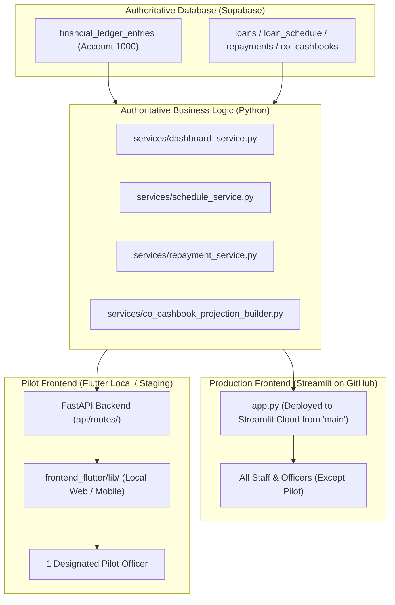

# Dual-Frontend Parity & Zero-Merge Governance Skill

## 1. Executive Summary & Purpose
This skill establishes the mandatory architectural and operational protocols for running **Streamlit (live on GitHub / production)** and **Flutter (local pilot / staging)** concurrently against the **same shared Supabase database**, without performing any git branch merges until the user explicitly approves.

When the user asks to modify business logic, fix bugs, adjust calculations, or audit parity:
1. **Both frontends must receive the changes** so that neither falls behind.
2. **Git branches (`main` and `flutter-migration`) must NEVER be merged** without explicit, unambiguous user confirmation.
3. **The single pilot officer using Flutter must experience 100% data, workflow, and visual parity** with Streamlit.

---

## 2. Core Non-Negotiable Invariants

### Invariant 1: The Zero-Merge Guardrail (DO NOT MERGE)
> [!CAUTION]
> **ABSOLUTE PROHIBITION ON BRANCH MERGING**:
> Under NO circumstances may the agent execute `git merge`, `git pull <branch>`, `git rebase`, or open/execute automated merge requests between `flutter-migration` and `main` unless the user explicitly types a direct command such as `"I approve merging flutter-migration into main"`.
> 
> - **Production (`main`)**: Serves the live Streamlit app deployed via GitHub.
> - **Migration / Pilot (`flutter-migration` or local Flutter workspace)**: Serves the local/pilot Flutter testing.
> - Both codebases must stay synchronized via **parallel implementation or cherry-picked single commits**, NEVER by merging branches.

### Invariant 2: The Dual-Frontend Parity Contract (Changes Apply to Both)
> [!IMPORTANT]
> **ANY CHANGE APPLIES TO BOTH STREAMLIT AND FLUTTER**:
> Whenever a bug fix, metric calculation, workflow enhancement, or business rule update is made:
> 1. **Core Service First**: Implement the change in the shared Python service/database layer (`services/`, `database/`, `domain/`).
> 2. **FastAPI Adapter Sync**: Ensure the corresponding endpoint in `api/routes/` exposes the updated service output.
> 3. **Streamlit UI Update**: Update `app.py` so the change is immediately active for all officers on GitHub Streamlit.
> 4. **Flutter UI Update**: Update the corresponding screen/widget in `frontend_flutter/lib/` so the pilot officer sees the exact same result.
> 
> Never update Streamlit and leave Flutter stale; never update Flutter and leave Streamlit stale.

### Invariant 3: Single-Officer Pilot Isolation on Live Database
> [!NOTE]
> The Flutter frontend connects to the **live Supabase database** (`zkphpwixqpebsctfklpd.supabase.co`).
> - Exactly **ONE officer** is testing Flutter.
> - All other officers and branch managers are using Streamlit.
> - Any write operation from Flutter (collection, withdrawal, loan submission, cashbook deposit) posts to the live ledger and operational tables.
> - Therefore, Flutter **MUST** use the exact same atomic RPCs (`atomic_execute_operations`) and financial ledger rules (Account 1000). A transaction created in Flutter must immediately appear in Streamlit's cashbooks and reports with zero reconciliation discrepancies.

---

## 3. Dual-Frontend Architecture & Data Flow

---

## 4. Disparity Elimination Checklist: Streamlit vs. Flutter

When auditing or eliminating disparities between Streamlit and Flutter, verify each of the following 7 core areas:

| Area | Streamlit (`app.py`) Reference | Flutter (`frontend_flutter/lib/`) Implementation | Parity Verification Check |
| :--- | :--- | :--- | :--- |
| **1. CO Dashboard KPIs** | `app.py` lines 3180–3200 (5 KPI cards: Full, Excess, Part, Not Paid, Overdue Arrears) | `co_dashboard_screen.dart` lines 310–335 | Ensure both display the exact 5 cards, same counts, and whole Naira amounts (₦, 0 decimals). |
| **2. CO Collections Sheet** | `app.py` lines 5650–5750 (Meeting portfolio, group members, expected repayment, overdue arrears, total due) | `daily_collections_screen.dart` lines 1400–1460 | Ensure all group members appear. Arrears and current installments must match to the exact Naira. |
| **3. CO Daily Cashbook** | `app.py` lines 10800–10850 (Opening balance, Loan Repayments, Inflows, Outflows, Bank Deposit, Closing) | `daily_cashbook_screen.dart` | Opening and Closing physical cash balances must equal Account 1000 physical ledger balance. |
| **4. BM Dashboard** | `app.py` BM sections (My Branch Today, Collections Compliance, PAR %, Officer Status) | `bm_dashboard_screen.dart` | PAR % and total overdue portfolio must be calculated from identical schedules without decimal drift. |
| **5. BM Master Cashbook** | `app.py` Master Cashbook (Aggregated branch vault cash, EOD reconcile) | `master_cashbook_screen.dart` | Inflow/Outflow columns must match Account 1000 debits/credits. |
| **6. Number & Currency Format** | Whole Nigerian Naira integers with commas: `₦{val:,.0f}` | `CurrencyFormatter.formatNaira(amount, showDecimals: false)` | **Zero decimal points / kobo** on any screen unless explicitly required for interest percentages. |
| **7. Visual Governance** | Clean corporate typography, zero emojis | Clean Material widgets, SVG icons only | **Zero-Emoji Rule**: Never use emoji characters (🔥, 💵, ⚠️, etc.) anywhere in either UI. |

---

## 5. Protocol for Implementing Changes (Step-by-Step)

Whenever the user requests a change or fix:

### Step 1: Check Invariants & Rules
Call `check-rules` skill to confirm double-entry accounting rules, schedule divisibility, Account 1000 immutability, and zero-emoji directives.

### Step 2: Implement in Shared Services
Apply the core calculation, database query, or business logic fix in `services/`, `database/`, or `domain/`.
*Rule*: The service function must remain the single source of truth for both frontends.

### Step 3: Update FastAPI Route (if applicable)
If the API endpoint in `api/routes/co/` or `api/routes/bm/` serializes data for Flutter, ensure its Pydantic schema and route adapter cleanly pass the updated service data.

### Step 4: Mirror to Both Frontends
1. **Update Streamlit**: Edit `app.py` to display or process the new logic.
2. **Update Flutter**: Edit the corresponding Dart file in `frontend_flutter/lib/` using Flutter design guidelines (`icare-flutter-design`).

### Step 5: Verify Both Frontends Locally
1. Run backend verification script: Confirm service output, API route response, and Account 1000 balance.
2. Check Streamlit: Confirm layout, metrics, and tables render cleanly.
3. Check Flutter: Confirm Dart models parse without runtime exceptions, widgets render cleanly without overflow, and numbers match Streamlit 100%.

### Step 6: Safe Git Operations (Zero-Merge)
- **Do NOT** execute `git merge flutter-migration` into `main`.
- If working on `main`: Commit changes that touch `app.py`, `services/`, and `frontend_flutter/`. Push to `origin/main` only when Streamlit production is ready for update.
- If working on `flutter-migration`: Commit changes without merging into `main`.
- Never execute commands that combine git histories without explicit user approval.

---

## 6. Pilot Officer Troubleshooting & Edge Cases

1. **Stale Local Backend**:
   - Because Flutter calls `http://127.0.0.1:8000`, whenever Python files in `services/` or `api/routes/` are modified, the local Uvicorn/FastAPI server MUST be restarted or run with `--reload`. Otherwise, Flutter will call stale endpoints and show disparities against Streamlit.
2. **Database Transaction Collision**:
   - Both Streamlit and Flutter write to the same Supabase database.
   - If the pilot officer posts collections for Group #24 in Flutter, Streamlit users will immediately see that Group #24 has been collected when they refresh their page.
   - Always ensure group collection status and repayment writes are idempotent and checked against `repayments` and `co_cashbooks`.
3. **Session Officer Context**:
   - In Flutter, ensure the login token corresponds to the specific pilot Credit Officer account (e.g. `co2` or `c32125e1-c7e5-4a85-8948-12d05b40eaa9`).
   - If Flutter is logged in as Officer A and Streamlit is viewed as Officer B, their numbers will naturally differ. Parity audits must always compare the **same officer** on the **same date**.
